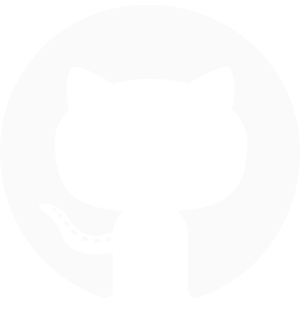
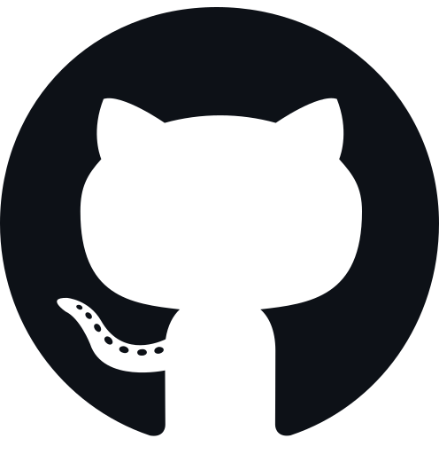

<!-- 13 17 23 -->
<!-- Banner do meu perfil -->

<!-- Algumas metricas views/stars/followers -->
 

<a href="https://github.com/Glauedson">
   
</a>
<a href="https://api.github-star-counter.workers.dev/user/Glauedson">
   
</a>

 

**Quem Sou Eu?**

Sou estudante de `Análise e Desenvolvimento de Sistemas` no `Instituto Federal de Ciência e Tecnologia do Ceará` **(IFCE).** Minha jornada no mundo da tecnologia começou cedo: aos 14 anos, comecei a programar pequenos jogos 3D na Unity, e logo depois mergulhei no universo dos jogos 2D com o GameMaker. Aos 15, descobri minha veia criativa e atuei como designer gráfico freelancer, o que também alimentou meu interesse por interfaces e estética visual.

Foi aos 18, ao ingressar na faculdade, que mergulhei de vez no mundo da programação. Desde então, venho dedicando meu tempo a estudar com profundidade as áreas de desenvolvimento, com foco especial em `Desenvolvimento Web Fullstack`. Apesar de estudar o ecossistema completo, meu verdadeiro ponto forte, e o que mais gosto de explorar, é o `Front-End`, onde consigo unir lógica, criatividade e design.
 ㅤ
 

<!-- um pouco sobre mim -->

<!-- Gif que fica ao lado da minha descrição simples -->
 

<!-- minha descrição simples -->
 <h3 align="center">
  
  Um Pouco Mais Sobre Mim 
  
 </h3>

 ⬛ Gosto de estar cercado por pessoas mais experientes que me desafiem a crescer. 
 ⬜ Atualmente trabalhando em projetos com React. 
 ⬛ Se quiser aprender um pouco sobre Front-end, sempre estarei disposto a ajudar. 
 ⬜ Tenho interesse em qualquer projeto grande que me faça pensar. 
 ⬛ Amante do Minimalismo.
 ㅤ
  <!-- minhas redes e spotify --> 
  
 

  
   
  

  

 

<!-- github status-->
<!-- Titutlo -->
<h3 align="center">

 Github Status 

</h3>
 

<!-- Status -->

<!-- Minhas Stacks -->
<!-- Titulo -->
<h3 align="center">
 
 Minhas Stacks 
 
</h3>

 

     
     
     
     

 

<!-- meus melhores repositorios -->

  <h3>
   
   Meus Melhores Repositorios 
   
  </h3> 

  

    
    

  

    
    

 

<!-- conquistas 
<h3 align="center">Minhas Conquistas</h3>

  

-->

<!-- ending-->

  

