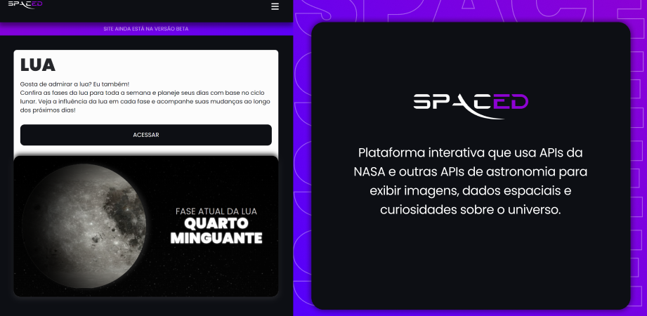

<!-- Onda Topo

  
   
-->

<!-- Onda Base 

  

-->

<!-- Capa do topo -->

<!-- Greeting -->
</h1>

Seja Bem-vindo

<h1 align="center">Eu Sou o Edson</h1>

<h4 align="left">Sou estudante de Análise e Desenvolvimento de Sistemas, com foco no desenvolvimento Front-End. Apaixonado por tecnologia e design, busco constantemente aprender novas ferramentas e aprimorar minhas habilidades.</h4> ㅤ

 

 

<!-- about me -->
 <h3 align="left">Um Pouco Sobre Mim</h3>

  🌱 Gosto de estar cercado por pessoas mais experientes que me desafiem a crescer. 
 🔭 Atualmente trabalhando em projetos com React. 
 💬 Se quiser aprender um pouco sobre Front-end, sempre estarei disposto a ajudar. 
 ⚡ Tenho interesse em qualquer projeto grande que me faça pensar. 
 ✨ Amante do Minimalismo. 
 ㅤ
  
 

  

   
   

  
  

</h4>

 

<!-- meus projetos 
<h3 align="center" width="100%">Meus Projetos:</h3>

    
    

-->

<!-- git stat-->
<h3 align="center">Github Status</h3>
 

<!-- Blue

-->

<!-- lang-->
<h3 align="center"> Minhas Stacks </h3>

 

   
     
     

 

<!-- top repo -->

  <h3> Meus Melhores Repositorios</h3>
  

    
    

<!-- ending-->

  

